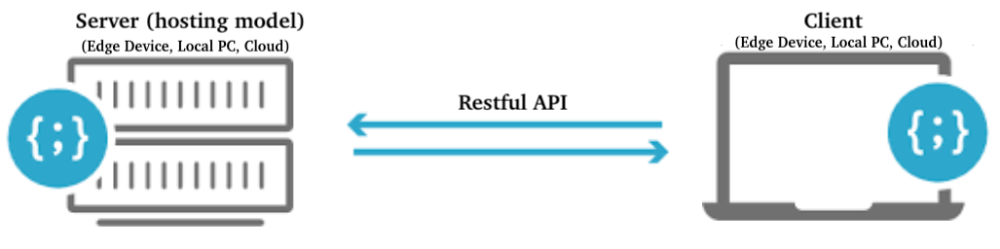
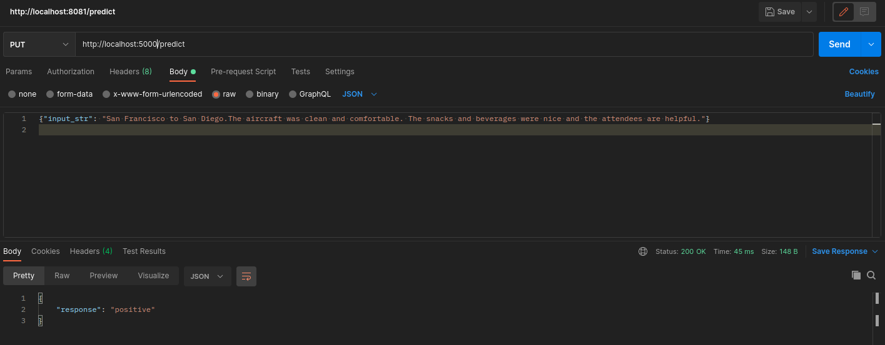

## Overview

<p align="center">
  
</p>  

**File Structure**
```
.
├── readme.md
|
├── deploy
│   ├── Dockerfile
│   ├── requirements.txt
│   ├── resources
│   │   ├── sklearn_model.pickle
│   │   └── sklearn_vectorizer.pickle
│   └── skdeploy.py
|
└── train
|   ├── requirements.txt
|   └── sktrain.ipynb
|
└── metadata
    └── postman.png
```

## Training

**Environment Creation**

Run the following commands in **train** folder

_Note_: Only need to create environment for once
```
conda create -n review_train python=3.8 -y
conda activate review_train
python -m pip install -r requirements.txt
```

**Run Training**
1. Prepare jupyter lab editor environment
```
jupyter lab
```

2. Run notebook

## Deployment

### Local Deployment / Testing

**Environment Creation**
Run the following commands in **deploy** folder

_Note_: Only need to create environment for once
```
conda create -n review_deploy python=3.8 -y
conda activate review_deploy
python -m pip install -r requirements.txt
```

**Run App**
```
# conda activate review_deploy
uvicorn skdeploy:app --host 0.0.0.0 --port 5000
```

### Docker Environment
- Images hosted at [docker hub](https://hub.docker.com/repository/docker/codenamewei/nlp)

**Build docker image**
```
docker build -t skreview .
docker tag skreview:latest codenamewei/nlp:skreview1.0
docker push codenamewei/nlp:skreview1.0
```

**Run docker image**
```        
docker pull codenamewei/nlp:skreview1.0
docker run -d -p 5000:5000 codenamewei/nlp:skreview1.0
```

_Sample Request_
```
PUT http://localhost:5000/predict

{"input_str": "San Francisco to San Diego.The aircraft was clean and comfortable. The snacks and beverages were nice and the attendees are helpful."}
```

<p align="center">
  
</p>  
