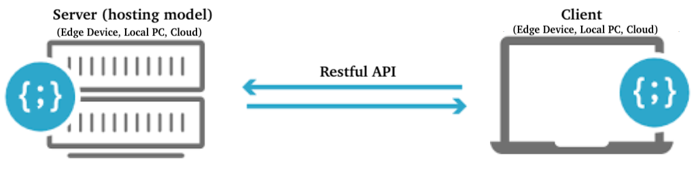
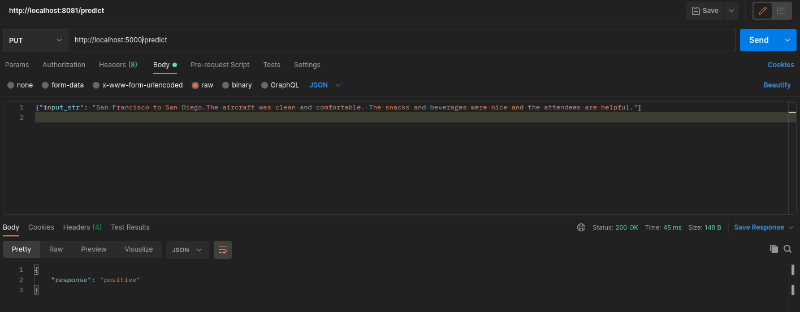

## Overview

<p align="center">
  
</p>  

**File Structure**
```
.
├── readme.md
|
├── deploy
│   ├── Dockerfile
│   ├── requirements.txt
│   ├── resources
│   │   ├── sklearn_model.pickle
│   │   └── sklearn_vectorizer.pickle
│   └── skdeploy.py
|
└── train
|   ├── requirements.txt
|   └── sktrain.ipynb
|
└── metadata
    └── postman.png
```

## Training

**Environment Creation**

Run the following commands in **train** folder

_Note_: Only need to create environment for once
```
conda create -n sentiment_train python=3.8
conda activate sentiment_train
pip install -r requirements.txt
```

**Run Training**
```
jupyter lab
```

## Deployment

### Local Deployment / Testing

**Environment Creation**
Run the following commands in **deploy** folder
_Note_: Only need to create environment for once
```
conda create -n sentiment_deploy python=3.8
conda activate sentiment_deploy
pip install -r requirements.txt
```

**Run App**
```
# conda activate sentiment_env
uvicorn skdeploy:app --host 0.0.0.0 --port 5000
```

### Docker Environment
- Images hosted at [docker hub](https://hub.docker.com/repository/docker/codenamewei/nlp)

**Build docker image**
```
docker build -t sksentiment .
docker tag sksentiment:latest codenamewei/nlp:sksentiment0.1.2
docker push codenamewei/nlp:sksentiment0.1.2
```

**Run docker image**
```        
docker pull codenamewei/nlp:sksentiment0.1.2
docker run -d -p 5000:5000 codenamewei/nlp:sksentiment0.1.2
```

_Sample Request_
```
PUT http://localhost:5000/predict

{"input_str": "San Francisco to San Diego.The aircraft was clean and comfortable. The snacks and beverages were nice and the attendees are helpful."}
```

<p align="center">
  
</p>  
