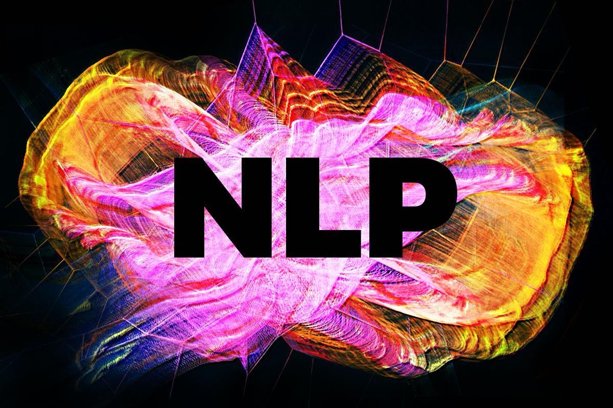

# Natural Language Processing (NLP) with Use Cases

  

  
Implementation of NLP use cases in various scenarios

# Use Cases
### **0. Word2Vec**  
Word2Vec Implementation in  
- **Java (DeepLearning4J)** - Training of word2vec skip-gram model on hotel industry corpus  
- **Python (Gensim)** - Visualization of word vectors trained with Glove

### **1. Spam Mail Filtering**  
Implementation of spam mail filtering with DeepLearning4J  
Medium Link: [here](https://link.medium.com/dtyjReZQM2)

### **2. News Group Classification**  
Serving of classification model with konduit-serving
The model trained with 20 classes of news types.  
Implementation in
- **Tensorflow 2.0**
- **HuggingFace Bert Embeddings with Keras Model**

### **3. Review Analysis**  
The use case of sentiment analysis of airlines reviews trained and served with docker on Digital Ocean.  
Implementation with
- Training: **Scikit-learn Random Forest**
- Deployment: **Docker & Digital Ocean**

Medium Posts
- [Part1](https://medium.datadriveninvestor.com/nlp-review-analysis-part-1-model-training-531f7f470b87)
- [Part2](https://medium.datadriveninvestor.com/nlp-review-analysis-part-2-model-serving-on-digital-ocean-a76d296eb53c)
